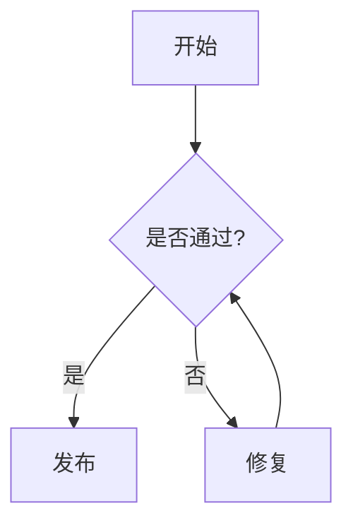

md
# Markdown 常用语法（GitHub 友好版）

> 说明：以下示例以 **GitHub Flavored Markdown（GFM）** 为准；避免使用 GitHub 不支持的 `==高亮==` 等语法。

---

## 一、文本格式

### 1) 标题
# 一级标题
## 二级标题
### 三级标题

### 2) 强调
- *斜体文本*
- **粗体文本**
- ***粗斜体文本***
- ~~删除线~~

### 3) 分隔线
---

### 4) 下划线（可用，但不推荐）
GitHub 支持部分 HTML，但样式一致性不保证：
<u>带下划线文本</u>

### 5) 脚注（GitHub 支持）
创建脚注格式类似这样 [^RUNOOB]。

[^RUNOOB]: 菜鸟教程 -- 学的不仅是技术，更是梦想！！！

### 6) 行内代码
使用 `git commit` 命令提交代码  
变量 `userName` 存储用户名  
在终端中输入 `npm install` 安装依赖  
要显示反引号：`` `code` ``

### 7) “高亮”替代写法（GitHub 不支持 ==mark==）
推荐用以下方式突出重点（更通用、显示稳定）：

> **重点**：这是需要强调的内容。

或使用 **加粗**：**重点内容**  
或使用行内代码：`重点内容`

---

## 二、列表

### 1) 列表嵌套
1. 主要任务
   - 子任务 A
   - 子任务 B
     1. 详细步骤 1
     2. 详细步骤 2
   - 子任务 C
2. 次要任务

### 2) 任务列表（GFM）
#### 设计阶段
- [x] 需求分析
- [x] 原型设计
- [ ] UI 设计

#### 开发阶段
- [ ] 前端开发
  - [x] 页面布局
  - [ ] 交互功能
  - [ ] 响应式适配
- [ ] 后端开发
  - [ ] 数据库设计
  - [ ] API 开发
  - [ ] 性能优化

#### 测试阶段
- [ ] 单元测试
- [ ] 集成测试
- [ ] 用户验收测试

---

## 三、引用与代码

### 1) 引用块
> **用户反馈**：这个功能很有用！
>
> > **开发团队回复**：感谢您的反馈，我们会继续优化。
> >
> > > **项目经理补充**：预计下个版本会有更多改进。

### 2) 代码区块
```python
def calculate_area(radius):
    """计算圆的面积"""
    import math
    return math.pi * radius ** 2

area = calculate_area(5)
print(f"圆的面积是: {area:.2f}")
```

---

## 四、链接 / 图片 / 表格

### 1) 行内链接
这是一个链接：[菜鸟教程](https://www.runoob.com)

### 2) 参考式链接（适合长文统一管理）
这个链接用 `1` 作为网址变量：[Google][1]  
这个链接用 `runoob` 作为网址变量：[Runoob][runoob]  
当参考标签与链接文字相同时，可省略第二个方括号：我喜欢使用 [GitHub][] 来管理代码。

[1]: http://www.google.com/
[runoob]: http://www.runoob.com/
[GitHub]: https://github.com

### 3) 图片（可点击）
[](链接URL)

### 4) 表格（GFM）
| 月份 |  收入   |  支出   |  利润   | 增长率 |
|:---:|--------:|--------:|--------:|-------:|
| 1月 | ¥50,000 | ¥35,000 | ¥15,000 | -      |
| 2月 | ¥55,000 | ¥38,000 | ¥17,000 | +13.3% |
| 3月 | ¥62,000 | ¥42,000 | ¥20,000 | +17.6% |
| **总计** | **¥167,000** | **¥115,000** | **¥52,000** | **+31.1%** |

---

## 五、数学公式与图表（GitHub 可用）

### 1) 数学公式（LaTeX）
行内公式：\(a^2 + b^2 = c^2\)

块级公式：
$$
\sum_{i=1}^{n} i = \frac{n(n+1)}{2}
$$

### 2) Mermaid 图表（GitHub 支持）


---

## 六、Markdown 实战：简历示例（GitHub 展示友好）

# 张三｜前端开发工程师

## 联系方式
- **邮箱**：zhangsan@email.com
- **电话**：138-0000-0000
- **GitHub**：https://github.com/zhangsan
- **LinkedIn**：https://linkedin.com/in/zhangsan
- **地址**：上海市浦东新区

## 职业目标
> 具有 3 年前端开发经验，专注 React 生态与现代 Web 应用开发。希望在创新型公司担任高级前端开发，参与架构设计与团队协作。

## 工作经验

### ABC 科技有限公司｜高级前端开发工程师
**2022.03 - 至今**
- 负责核心产品前端开发，用户量 **100 万+**
- 使用 React、TypeScript 构建可维护的单页应用
- 与产品/设计协作，将设计稿高质量落地
- 建立前端组件库，团队开发效率提升 **30%**
- **技术栈**：React / TypeScript / Redux / Webpack / Jest

### XYZ 互联网公司｜前端开发工程师
**2021.06 - 2022.02**
- 参与电商平台前端开发与维护
- 性能优化：首屏加载时间减少 **40%**
- 负责移动端 H5 开发与多设备适配
- **技术栈**：Vue.js / JavaScript / SCSS / Element UI

如果你希望它在 GitHub 上更像“文档/README”，我也可以帮你加一个顶部目录（TOC）和“折叠内容（`<details>`）”版式，让页面更短更清晰。
