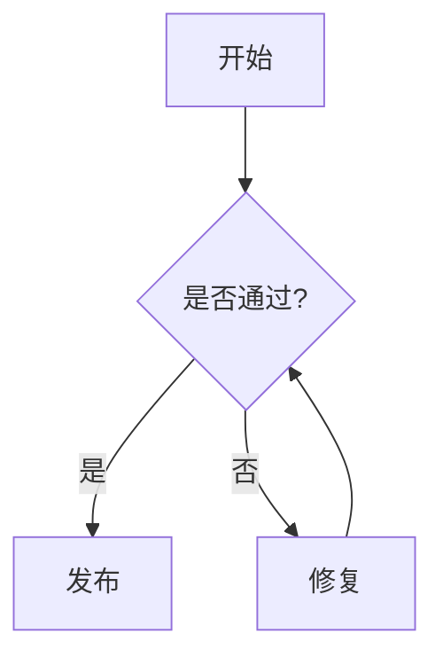

md
# Markdown 常用语法（GitHub / VS Code 友好）

> 本文以 **GitHub Flavored Markdown（GFM）** 为准；避免 `==高亮==` 等 GitHub 不支持语法。  
> 建议：把“示例”折叠起来，阅读更清爽。

## 目录
- [一、文本格式](#一文本格式)
- [二、列表](#二列表)
- [三、引用与代码](#三引用与代码)
- [四、链接 / 图片 / 表格](#四链接--图片--表格)
- [五、数学公式与图表](#五数学公式与图表)
- [六、Markdown 实战：简历示例](#六markdown-实战简历示例)

---

## 一、文本格式

### 标题
<details>
<summary>展开示例</summary>

```md
# 一级标题
## 二级标题
### 三级标题
```
</details>

### 强调 / 删除线
<details>
<summary>展开示例</summary>

```md
*斜体文本*
**粗体文本**
***粗斜体文本***
~~删除线~~
```
</details>

### 分隔线
<details>
<summary>展开示例</summary>

```md
---
```
</details>

### 下划线（不推荐）
GitHub 支持部分 HTML，但不同主题/渲染一致性不保证。
<details>
<summary>展开示例</summary>

```md
<u>带下划线文本</u>
```
</details>

### 脚注（GitHub 支持）
<details>
<summary>展开示例</summary>

```md
创建脚注格式类似这样 [^RUNOOB]。

[^RUNOOB]: 菜鸟教程 -- 学的不仅是技术，更是梦想！！！
```
</details>

### 行内代码
<details>
<summary>展开示例</summary>

```md
使用 `git commit` 命令提交代码  
变量 `userName` 存储用户名  
要显示反引号：`` `code` ``
```
</details>

### “高亮”替代（GitHub 不支持 ==mark==）
推荐用引用块做“提示条”：
<details>
<summary>展开示例</summary>

```md
> **重点**：这是需要强调的内容。
```
</details>

---

## 二、列表

### 列表嵌套
<details>
<summary>展开示例</summary>

```md
1. 主要任务
   - 子任务 A
   - 子任务 B
     1. 详细步骤 1
     2. 详细步骤 2
   - 子任务 C
2. 次要任务
```
</details>

### 任务列表（GFM）
<details>
<summary>展开示例</summary>

```md
#### 设计阶段
- [x] 需求分析
- [x] 原型设计
- [ ] UI 设计

#### 开发阶段
- [ ] 前端开发
  - [x] 页面布局
  - [ ] 交互功能
  - [ ] 响应式适配
- [ ] 后端开发
  - [ ] 数据库设计
  - [ ] API 开发
  - [ ] 性能优化
```
</details>

---

## 三、引用与代码

### 引用块（可嵌套）
<details>
<summary>展开示例</summary>

```md
> **用户反馈**：这个功能很有用！
>
> > **开发团队回复**：感谢您的反馈，我们会继续优化。
> >
> > > **项目经理补充**：预计下个版本会有更多改进。
```
</details>

### 代码区块（带语言高亮）
<details>
<summary>展开示例</summary>

```md
```python
def calculate_area(radius):
    """计算圆的面积"""
    import math
    return math.pi * radius ** 2

print(calculate_area(5))
```
```
</details>

---

## 四、链接 / 图片 / 表格

### 链接（行内 / 参考式）
<details>
<summary>展开示例</summary>

```md
行内链接：[菜鸟教程](https://www.runoob.com)

参考式链接：[Google][1]、[Runoob][runoob]、[GitHub][]
[1]: http://www.google.com/
[runoob]: http://www.runoob.com/
[GitHub]: https://github.com
```
</details>

### 图片（可点击）
<details>
<summary>展开示例</summary>

```md
[](链接URL)
```
</details>

### 表格（GFM）
<details>
<summary>展开示例</summary>

```md
| 月份 |  收入   |  支出   |  利润   | 增长率 |
|:---:|--------:|--------:|--------:|-------:|
| 1月 | ¥50,000 | ¥35,000 | ¥15,000 | -      |
| 2月 | ¥55,000 | ¥38,000 | ¥17,000 | +13.3% |
| 3月 | ¥62,000 | ¥42,000 | ¥20,000 | +17.6% |
| **总计** | **¥167,000** | **¥115,000** | **¥52,000** | **+31.1%** |
```
</details>

---

## 五、数学公式与图表

### 数学公式（LaTeX）
<details>
<summary>展开示例</summary>

```md
行内：\(a^2 + b^2 = c^2\)

块级：
$$
\sum_{i=1}^{n} i = \frac{n(n+1)}{2}
$$
```
</details>

### Mermaid 图表（GitHub 支持）
<details>
<summary>展开示例</summary>

```md

```
</details>

---

## 六、Markdown 实战：简历示例

<details>
<summary>展开简历示例</summary>

```md
# 张三｜前端开发工程师

## 联系方式
- **邮箱**：zhangsan@email.com
- **电话**：138-0000-0000
- **GitHub**：https://github.com/zhangsan
- **LinkedIn**：https://linkedin.com/in/zhangsan
- **地址**：上海市浦东新区

## 职业目标
> 具有 3 年前端开发经验，专注 React 生态与现代 Web 应用开发。希望担任高级前端开发，参与架构设计与团队协作。

## 工作经验

### ABC 科技有限公司｜高级前端开发工程师
**2022.03 - 至今**
- 负责核心产品前端开发，用户量 **100 万+**
- 使用 React、TypeScript 构建可维护单页应用
- 与产品/设计协作，高质量落地
- 建立组件库，效率提升 **30%**
- **技术栈**：React / TypeScript / Redux / Webpack / Jest

### XYZ 互联网公司｜前端开发工程师
**2021.06 - 2022.02**
- 参与电商平台前端开发与维护
- 性能优化：首屏加载时间减少 **40%**
- 移动端 H5 开发与多设备适配
- **技术栈**：Vue.js / JavaScript / SCSS / Element UI
```
</details>
